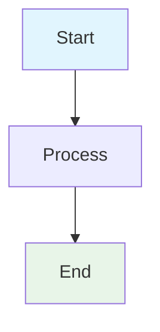
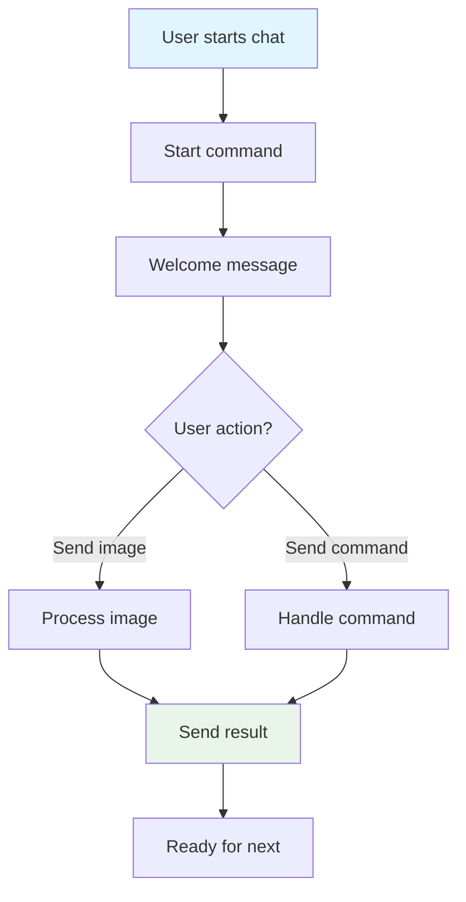
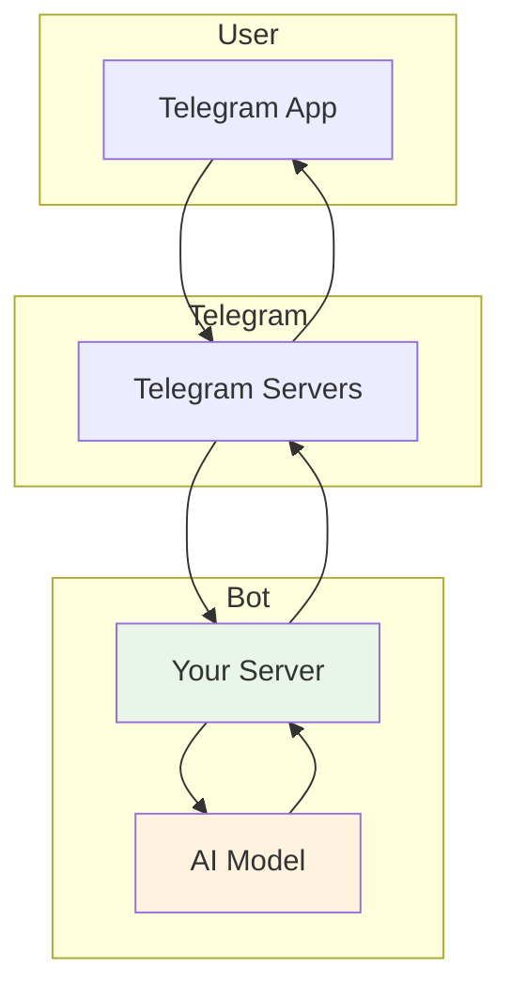
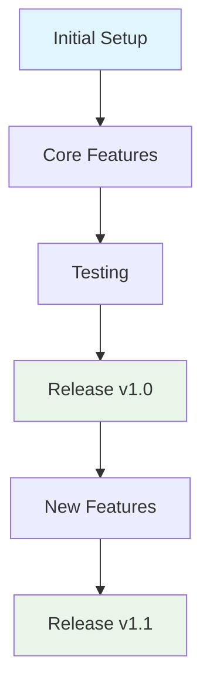
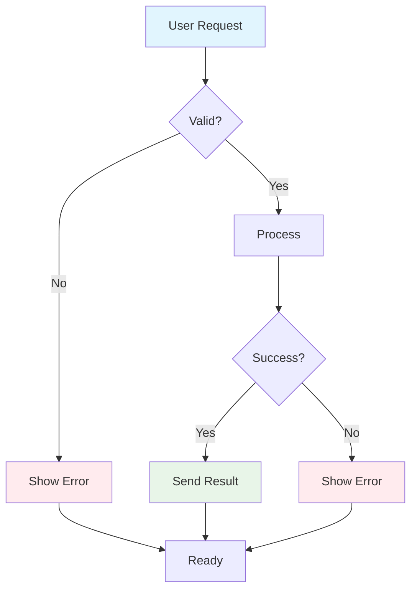

# 🧪 Mermaid Diagram Test

This file tests if all Mermaid diagrams render correctly on GitHub.

## ✅ Simple Flow Test

## ✅ User Interaction Flow (Fixed)

## ✅ Simple Architecture

## ✅ Development Flow (Fixed)

## ✅ Error Handling

---

**All diagrams should render correctly on GitHub!** ✅

If you see any rendering errors, the issue is likely:
1. Special characters in node text (like `/start`)
2. Unsupported diagram types (like `gitgraph`)
3. Syntax errors in the Mermaid code

**Fixed Issues:**
- ✅ Removed `/start` special character
- ✅ Replaced `gitgraph` with `graph TD`
- ✅ Simplified complex flows
- ✅ Added proper styling
