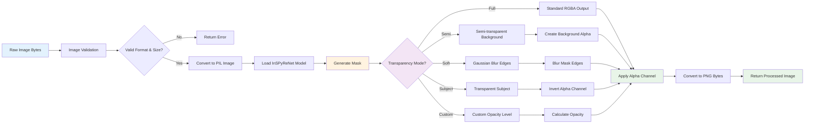
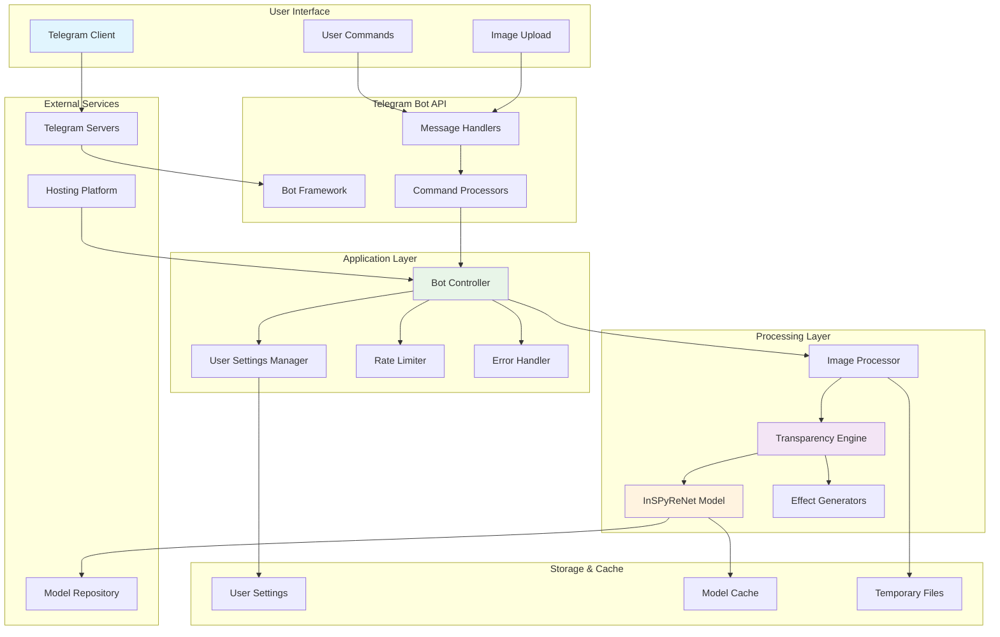
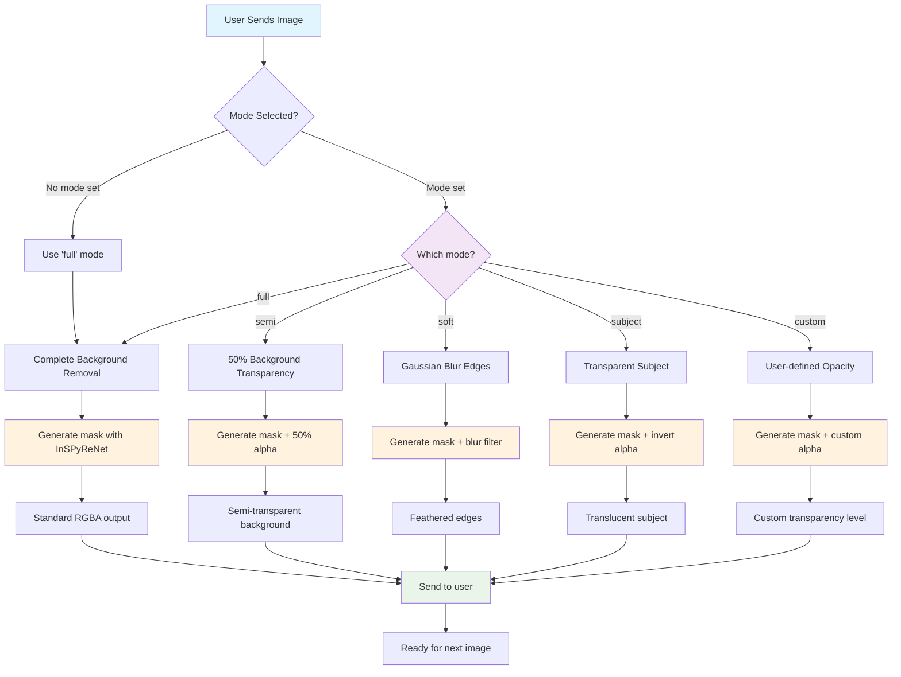
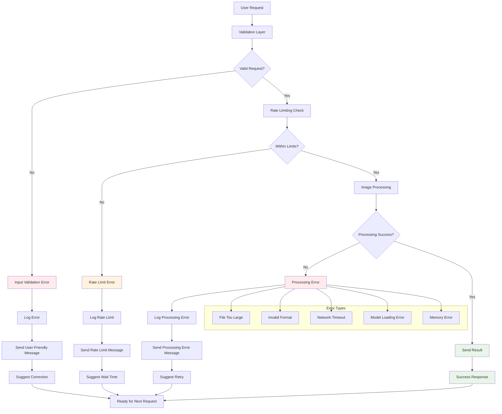

# 🔄 System Flow Diagrams

This document contains comprehensive flow diagrams showing how the Telegram Transparency Master Bot works.

## 📱 User Interaction Flow

```mermaid
flowchart TD
    A[User starts chat] --> B[/start command]
    B --> C[Welcome message with transparency options]
    
    C --> D{User action?}
    
    D -->|Send image directly| E[Use default 'full' mode]
    D -->|Send mode command| F[Parse mode command]
    D -->|Send /help| G[Show help message]
    D -->|Send /modes| H[Show all transparency modes]
    D -->|Send /settings| I[Show current settings]
    
    F --> J{Valid mode?}
    J -->|Yes| K[Update user settings]
    J -->|No| L[Show error message]
    
    K --> M[Confirm mode change]
    L --> D
    M --> N[Wait for image]
    
    E --> O[Process image]
    N --> P[Receive image]
    P --> Q[Validate image]
    
    Q --> R{Valid image?}
    R -->|No| S[Show validation error]
    R -->|Yes| T[Check rate limit]
    
    T --> U{Within limit?}
    U -->|No| V[Show rate limit error]
    U -->|Yes| W[Show processing message]
    
    W --> X[Apply transparency effect]
    X --> Y{Processing successful?}
    Y -->|No| Z[Show processing error]
    Y -->|Yes| AA[Send processed image]
    
    AA --> BB[Delete processing message]
    BB --> CC[Ready for next image]
    
    S --> D
    V --> D
    Z --> D
    CC --> D
    G --> D
    H --> D
    I --> D
    
    style A fill:#e1f5fe
    style C fill:#f3e5f5
    style O fill:#fff3e0
    style X fill:#e8f5e8
    style AA fill:#e8f5e8
```

## 🖼️ Image Processing Pipeline



## 🏗️ System Architecture



## 🎨 Transparency Modes Decision Tree



## 🚀 Development and Deployment Flow

```mermaid
gitgraph
    commit id: "Initial Setup"
    commit id: "Core Bot Logic"
    commit id: "Transparency Features"
    
    branch develop
    checkout develop
    commit id: "Add Semi Mode"
    commit id: "Add Soft Edges"
    commit id: "Add Custom Opacity"
    
    checkout main
    merge develop
    commit id: "Release v1.0.0"
    
    branch feature/docker
    checkout feature/docker
    commit id: "Add Dockerfile"
    commit id: "Add Docker Compose"
    commit id: "Test Container"
    
    checkout main
    merge feature/docker
    commit id: "Release v1.1.0"
    
    branch hotfix/memory-leak
    checkout hotfix/memory-leak
    commit id: "Fix Memory Issue"
    
    checkout main
    merge hotfix/memory-leak
    commit id: "Release v1.1.1"
```

## ⚠️ Error Handling Flow



## 📊 Flow Summary

### Key Components:

1. **User Interface Layer**: Telegram client interaction
2. **Bot Framework**: Message handling and command processing
3. **Application Logic**: User settings, rate limiting, error handling
4. **AI Processing**: InSPyReNet model and transparency effects
5. **Storage**: User preferences and model caching

### Transparency Modes:

- **Full**: Complete background removal (default)
- **Semi**: 50% transparent background
- **Soft**: Feathered edges with Gaussian blur
- **Subject**: Translucent subject with transparent background
- **Custom**: User-defined opacity levels

### Error Handling:

- Input validation for file size and format
- Rate limiting to prevent abuse
- Comprehensive error logging
- User-friendly error messages
- Automatic retry suggestions

### Development Workflow:

- Feature branches for new functionality
- Main branch for stable releases
- Hotfix branches for critical issues
- Automated CI/CD pipeline
- Docker containerization support
