# 🤖 How the Telegram Bot Works

This document explains how your Telegram Transparency Master Bot communicates with users and processes images.

## 🔍 Common Question: "How does the bot connect to my PC?"

**Short Answer:** Your PC connects TO Telegram and waits for messages. Users never connect directly to your PC.

## 📡 The Communication Flow

### How It Actually Works

```mermaid
sequenceDiagram
    participant U as 👤 User (Phone)
    participant T as 📱 Telegram App
    participant TS as 🌐 Telegram Servers
    participant YPC as 🖥️ Your PC/Server
    participant AI as 🤖 InSPyReNet Model
    
    Note over YPC: Bot starts up and begins polling
    YPC->>TS: "Hi, I'm bot with token ABC123, any messages for me?"
    TS->>YPC: "No messages yet"
    
    Note over YPC,TS: Bot keeps asking every few seconds
    
    loop Every 1-2 seconds
        YPC->>TS: "Any new messages for me?"
        TS->>YPC: "Nope, still waiting..."
    end
    
    Note over U: User sends image to bot
    U->>T: Selects image and sends to @YourBot
    T->>TS: Uploads image (gets file_id)
    
    YPC->>TS: "Any new messages for me?"
    TS->>YPC: "YES! Here's an image from User123"
    
    Note over YPC: Bot processes image
    YPC->>TS: Downloads image using file_id
    YPC->>AI: Process image with transparency mode
    AI->>YPC: Returns processed image bytes
    
    YPC->>TS: "Send this processed image back to User123"
    TS->>T: Delivers processed image
    T->>U: Shows transparent image
    
    Note over YPC,TS: Bot continues waiting for next message
    
    loop Continues forever
        YPC->>TS: "Any new messages for me?"
        TS->>YPC: "Nothing new..."
    end
```



## 🏗️ Architecture Overview

### Your PC/Server Role

When you run `python bot.py`, your computer becomes a server that:

```
🖥️ Your PC/Server:
├── 🐍 Python running bot.py
├── 🤖 InSPyReNet AI model loaded in memory
├── 🌐 Internet connection to Telegram
├── 📡 Continuously polling for messages
└── 🔄 Processing images and sending results
```

### What Users See vs Reality


## 🔄 The Polling Process

### Continuous Connection

Your bot maintains a persistent connection to Telegram:

```python
# What happens when you run python bot.py
async def run(self):
    logger.info("Starting Background Removal Bot...")
    await self.application.initialize()
    await self.application.start()
    await self.application.updater.start_polling()  # 👈 This line!
    
    logger.info("Bot is running! Press Ctrl+C to stop.")
    
    # Keep running until interrupted
    try:
        await asyncio.Event().wait()  # 👈 Waits forever!
    except KeyboardInterrupt:
        logger.info("Stopping bot...")
```

### The Polling Loop (Simplified)

```python
# What start_polling() does internally:
while True:
    # Ask Telegram: "Any new messages for my bot?"
    updates = await telegram_api.get_updates(
        token=BOT_TOKEN,
        offset=last_update_id
    )
    
    if updates:
        for update in updates:
            # Process each message/image
            await handle_update(update)
    
    # Wait a bit, then ask again
    await asyncio.sleep(1)
```

## 🔑 Authentication with Bot Token

### How Telegram Knows Your Server


### Bot Token = Your Bot's Identity

```python
# In your .env file
BOT_TOKEN=1234567890:ABCdefGHIjklMNOpqrsTUVwxyz

# This token tells Telegram:
# "Messages for @YourBot should go to whoever has this token"
```

## 🌐 Network Requirements

### What Your PC/Server Needs

✅ **Required:**
- Stable internet connection
- Ability to make HTTPS requests to `api.telegram.org`
- Enough RAM for the AI model (1-2GB)
- Python and dependencies installed

❌ **NOT Required:**
- Port forwarding
- Firewall configuration
- Static IP address
- Domain name
- Incoming connections

### API Calls Your Bot Makes

```bash
# Every few seconds, your bot does this:
GET https://api.telegram.org/bot{BOT_TOKEN}/getUpdates

# Telegram responds with:
{
  "ok": true,
  "result": [
    {
      "update_id": 123456,
      "message": {
        "message_id": 789,
        "from": {"id": 987654321, "first_name": "John"},
        "photo": [{"file_id": "ABC123", "width": 1920, "height": 1080}]
      }
    }
  ]
}
```

## 🖼️ Image Processing Flow

### Complete Image Journey

```mermaid
sequenceDiagram
    participant U as 👤 User
    participant TS as 🌐 Telegram Servers
    participant YS as 🖥️ Your Server
    participant M as 🤖 InSPyReNet Model
    
    Note over U,M: User sends image to your bot
    
    U->>TS: Sends image to @YourBot
    TS->>YS: "New photo with file_id=ABC123"
    
    Note over YS: Your bot receives the update
    
    YS->>TS: "Give me file ABC123"
    TS->>YS: Returns image bytes
    
    Note over YS,M: Image processing happens on your server
    
    YS->>M: Process image with transparency mode
    M->>YS: Returns processed image bytes
    
    Note over YS: Your bot sends result back
    
    YS->>TS: Upload processed image
    TS->>U: Delivers processed image
    
    Note over U: User receives processed image!
```



### Where Processing Happens

```
❌ User's Phone: No processing here
❌ Telegram Servers: No AI processing here  
✅ Your Server: All AI processing happens here
```

## 🚀 Deployment Scenarios

### Development (Your PC)

```bash
# Run locally for testing
python bot.py

# What happens:
# - Your PC connects to Telegram
# - Your PC polls for messages
# - Processing happens on your PC
# - Stop with Ctrl+C
```

**Console Output:**
```bash
PS D:\Projects\BGTGBot> python bot.py

2024-01-15 10:30:15 - INFO - Starting Background Removal Bot...
2024-01-15 10:30:16 - INFO - Model initialized successfully
2024-01-15 10:30:17 - INFO - Bot is running! Press Ctrl+C to stop.

# Bot is now waiting... polling Telegram every few seconds
# When user sends image:
2024-01-15 10:35:22 - INFO - Processing image of size: (1920, 1080)
2024-01-15 10:35:45 - INFO - Successfully processed image. Output size: 2.3MB
```

### Production (Cloud Server)

```bash
# Deploy to cloud server
railway deploy
# OR
docker-compose up -d

# What happens:
# - Cloud server connects to Telegram
# - Cloud server polls 24/7
# - Processing happens on cloud server
# - Runs continuously even when your PC is off
```

## 🔄 Two Connection Methods

### 1. Polling (What We Use)

```python
# Your bot asks Telegram: "Any new messages for me?"
await self.application.updater.start_polling()
```

**Flow:**
```
Your Server: "Any messages for me?"
Telegram: "Yes, here's an image from User123"
Your Server: "Processing... Done! Here's the result"
Telegram: "Thanks, I'll send it to User123"
```

### 2. Webhooks (Alternative)

```python
# Telegram pushes messages to your server
app.run_webhook(webhook_url="https://yourserver.com/webhook")
```

**Flow:**
```
Telegram → POST https://yourserver.com/webhook
{
  "message": {
    "photo": [...],
    "from": {"id": 123456}
  }
}
```

## 💡 Key Insights

### 1. Your PC/Server is the "Bot Server"
When you run the bot, your computer becomes the server that processes images.

### 2. Continuous Connection
Your bot maintains a persistent connection to Telegram, constantly asking "any messages for me?"

### 3. No Incoming Connections
Users never connect directly to your PC. Everything goes through Telegram's servers.

### 4. Processing Location
All AI processing (InSPyReNet model) runs on your PC/server, not on Telegram's servers.

### 5. Bot Token is the Key
The bot token authenticates your server with Telegram and routes messages to your bot.

## 🎯 Summary

**The simple answer:** Your PC connects TO Telegram and waits for messages. When a user sends an image to your bot:

1. **User sends image** → Telegram stores it
2. **Your PC asks Telegram** → "Any messages for me?"
3. **Telegram responds** → "Yes, here's an image!"
4. **Your PC downloads** → Image from Telegram
5. **Your PC processes** → Image with AI model
6. **Your PC uploads** → Result back to Telegram
7. **Telegram delivers** → Processed image to user

The user never knows where your server is - they just interact with your bot through Telegram! 🤖✨
